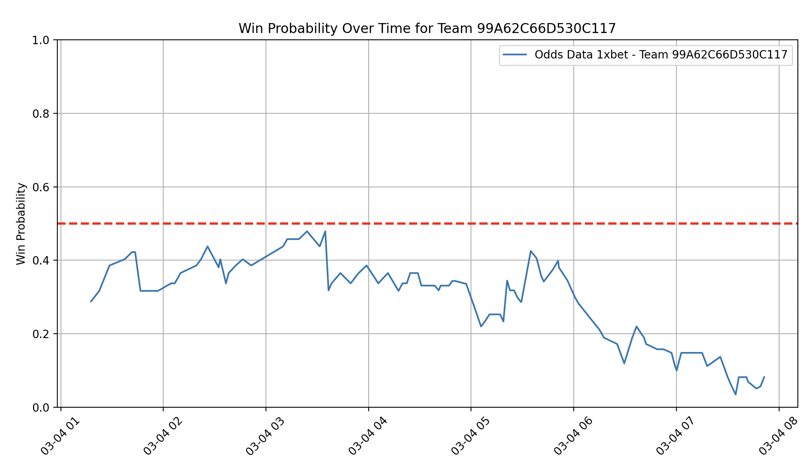
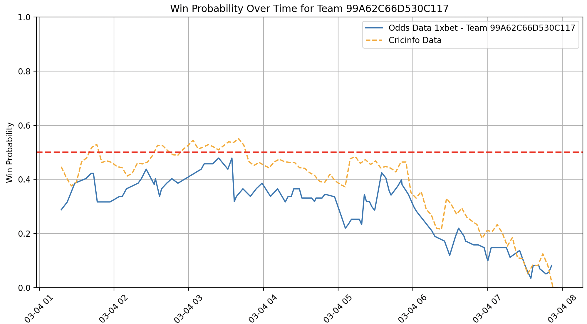
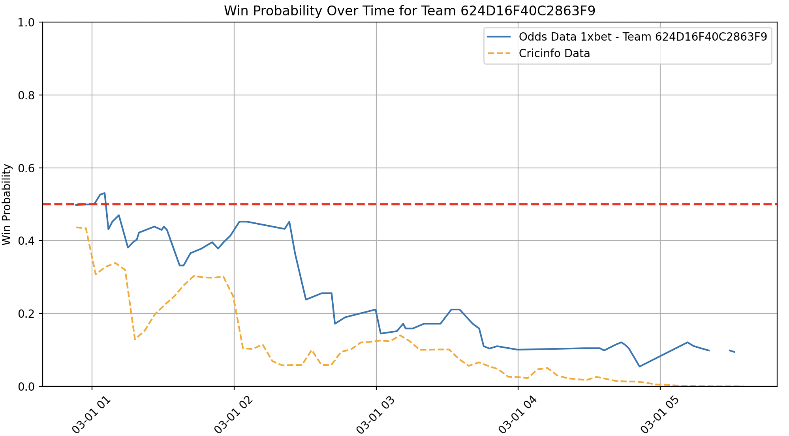
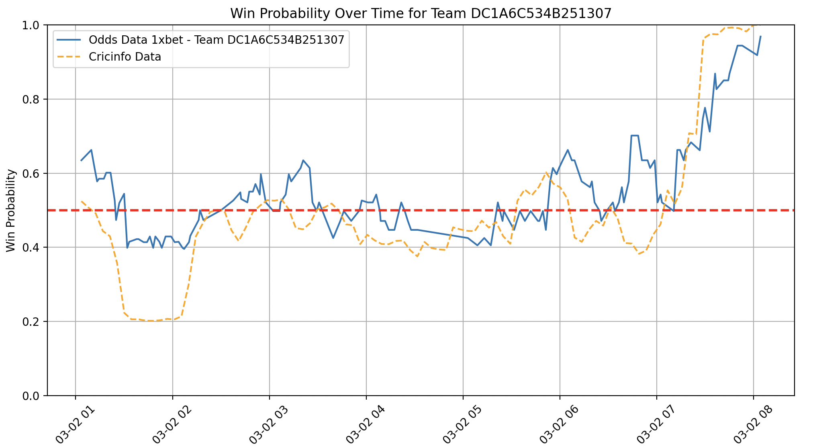
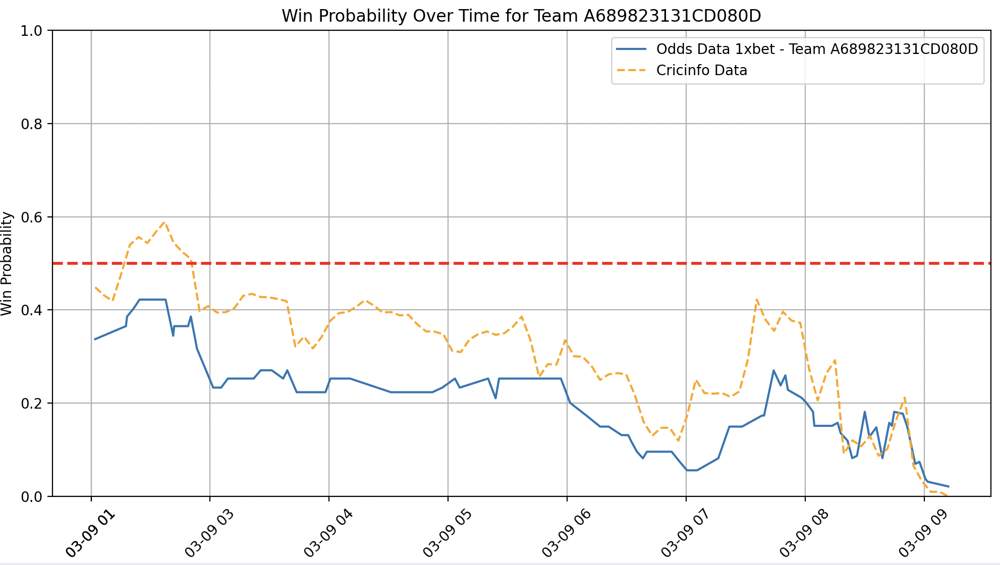
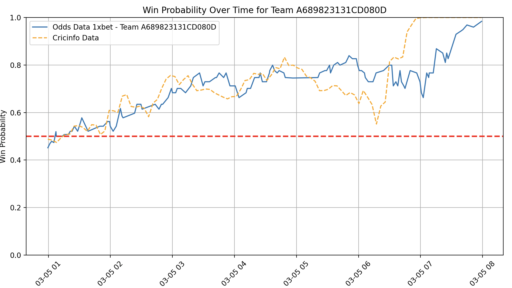

```{r setup, include=FALSE}
knitr::opts_chunk$set(echo = TRUE)
```

```{r, include=FALSE, echo=FALSE}
# include necessary libraries:
library(ggplot2)
library(tidyverse)
```


# Goal:

- The Unicorns have developed tools that do predictions that are outwardly more accurate than the win probability you see on CricInfo. 
- We want to see how these prediction tools compare to the "state of the art", in other words what the sports books are using. We can do this by comparing the Unicorns' prediction tool to the live odds put out by various sports books. 
  + We hope to validate our results and the accuracy of our predictions
  + In an ideal scenario, we find out that the Unicorns' tools are significantly more accurate than the sports books, in which case we would have the potential to monetize this tool. 
  

# Phase 1:

1. **Figure out how to extract the odds data from sports books**
2. **Check if the CricInfo win probability and the implied win probability for sports books significantly differ**


# Phase 2:

1. **Identify major differences in terms of reaction to events between CricInfo and sports books, if any**
2. **Understand how the Unicorns' prediction tool's algorithm predicts in comparison to sports books**
3. **Running this on live games to see the accuracy of our algorithm compared to sports books**
4. **More detailed analysis and checking the viability of any monetization of the tool**


# Research on sports books / APIs:

- I wanted to first check the cricket related markets available for various sports books in the US
- I shortlisted a lot of commonly used sportsbooks in the US and created a quick table to compare them
- An important factor was to see if any of these books had an official API, that way, we would not have to search for other APIs in order to extract the odds data we need. 

| Sportsbook    | Live Betting / Moneyline? | Types of Bets Offered     |
|---------|-----|---------|
| PrizePicks   | NO  | Over/Unders only: runs, 4s, 6s, wickets. Lines not offered often |
| Underdog     | NO  | Over/Unders only (very similar to PrizePicks) |
| Draftkings | YES  | Many tournaments to bet on: Big Bash, ODIs, IPL, World Cup, etc. Offers moneyline, player props, match props, and awards  |
| BallyBet | YES  | Very similar to DraftKings |
| BetMGM | YES  | Props similar to DraftKings, but not as many. No odds available for less mainstream games like USA vs Oman |
| Bet365 | YES  | Bet365 and Fanduel probably have the most amount of props on cricket. Same game parlay (SGP) feature offered |
| FanDuel | YES  | Bet365 and Fanduel probably have the most amount of props on cricket. Random special props also offered |


- Only PrizePicks has an official API, however it is not useful to us because they don't have moneyline or live odds available, so I had to look for other APIs.
- Bet365 offered odds on 1st innings runs scored both before the match and during the match. This is the market we are ideally looking for, since the Unicorns' tool is focused on forecasting the score of an innings. 
- After extensive search, looking at sites like BetsAPI, OpticOdds, PropOdds, The Odds API, among other sites, I settled on **OpticOdds API**, as they seemed to be the best in terms of clear communication, lots of coverage, and they were a relatively reputable site. 


# Optic Odds API evaluation:

- I was able to get in contact with an OpticOdds representative (Abe Granoff) and schedule a meeting with him. He gave me a 10 day trial key with full access to their API, and I used those 10 days to find out what all their API covered. I found that they had extensive coverage of cricket odds on **1xbet** as well as **bet365**. 
- On 1xbet specifically, I was able to gather live moneyline odds as the game progressed, so I decided to use 1xbet moneyline odds for the rest of my analysis.
- Abe mentioned that the price for this package could range from around 3K to 5K dollars per month, depending on the leagues and markets we decide to access. I am actively communicating with him to see if we can settle on a price
- One advantage of OpticOdds is that if we do decide to come on as a client, they will try to expand coverage to our needs. For example, they currently do not have coverage of live "total innings runs" odds, however he said his team will work on it. They are constantly expanding coverage and he continues to update me whenever they do.  


# Champions Trophy Game Analysis:

- I collected live moneyline odds data from 1xbet for 5 different Champions Trophy games. I then calculated the implied win probabilities for each team and plotted them on a graph. My goal was to create a graphic similar to the win probability graphic on CricInfo. An example of one of the graphs is shown below:
- The graph shows Australia's win probability over time against India in the Champions Trophy Semifinal




# Comaprison against CricInfo:

- The next step was to compare the CricInfo win probability with the sports book win probability, and the best way to visualize this comparison would be to overlay the two lines on the same graphic. Unfortunately, the CricInfo graph updates every **over** (x-axis = overs), while my moneyline graph updates every **2 minutes** (x-axis = timestamp). 
- I was able to scale the overs to match to timestamps by making it such that the first over corresponded to the start time of the game, while the last over corresponded to the last available open moneyline market time (which usually occurs near the end of the game). For this reason, the overlaying isn't perfect, but it is a quick and easy way to visually assess how close the two lines correlate

### Australia win probability vs. India in the Semifinal



### England win probability vs. South Africa in the Group Stage



### India win probability vs. New Zealand in the Group Stage



### New Zealand win probability vs. India in the Final



### New Zealand win probability vs. South Africa in the Semifinal




# Next Steps:

- what data would be ideal from CricInfo for me to compare better
- time vs balls (x-axis)
- Ability to run our algorithm live and compare with books (what would help with phase 2)


# TO DO:

- Give link to data...


